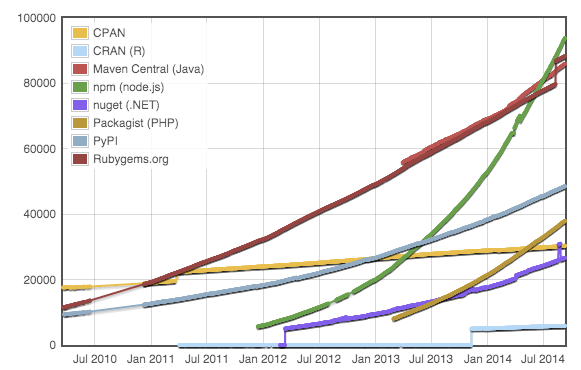
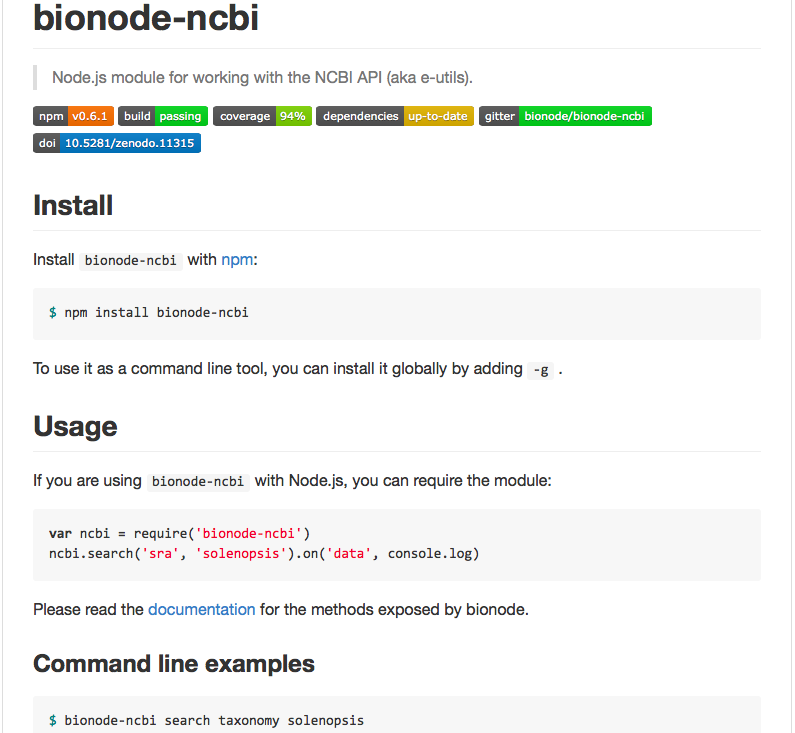

## Sanger 2014

<!-- We will need a Flash presentation from you which should be a maximum of 5 minutes with a brief introduction and synopsis of your career plus your work/involvement in the areas this workshop is covering and a maximum of 4 slides - this needs to be with us by latest 8 September (apologies for the short notice). -->

<p style="float: left;"><a href="//bmpvieira.com/allbio14" target="_blank">bmpvieira.com/sanger14</a></p>
<br>

<div class="fragment">

<p>
[Bruno Vieira](http://bmpvieira.com) | <i class="fa fa-twitter"></i> <a href="//twitter.com/bmpvieira" target="_blank">@bmpvieira</a>
</p>
</div>

<div class="fragment">
<p class="fragment">Phd Student @ <a href="http://www.qmul.ac.uk" target="_blank"></a>
</p>
<p class="fragment">
Bioinformatics and Population Genomics
</p>
<span style="font-size:0.8em;">
<p class="fragment">
Supervisor:  
Yannick Wurm | <i class="fa fa-twitter"></i>  <a href="//twitter.com/yannick__" target="_blank">@yannick__</a>
</p>
</span>
</div>
<small class="fragment">
<p>Before:</p>
<a href="http://www.ciencias.ulisboa.pt" target="_blank"></a>
<a href="http://cobig2.com" target="_blank"></a>
<a href="http://eseb2013.com" target="_blank"></a>
<a href="https://geekli.st" target="_blank">
<a href="http://www.bbsrc.ac.uk" target="_blank">

</small>
<div style="position:absolute; top: 90%; font-size:.35em;">
© 2014 <a href="http://bmpvieira.com" target="_blank">Bruno Vieira</a> <a href="http://creativecommons.org/licenses/by/4.0/deed.en_US" target="_blank">CC-BY 4.0</a>
</div>


---

### Some problems I faced during my research:

<ul>
<li class="fragment"> Difficulty getting relevant descriptions and datasets from NCBI API using bio\* libs</li>

<li class="fragment">For web projects, needed to implement the same functionality on browser and server</li>

<li class="fragment">Difficulty writing scalable, reproducible and complex bioinformatic pipelines</li>
</ul>

---

<!-- <div style="float: left; max-width:10%"> -->

**[Bionode.io](http://bionode.io)** <span class="fragment" style="font-size: .8em;"> - *Modular and universal bioinformatics*</span>


<span class="fragment" style="font-size: .7em; line-height:10%;">Pipeable UNIX command line tools and JavaScript / Node.js APIs for bioinformatic analysis workflows on the server and browser.<br><span class="fragment" style="font-size:.7em;">Collaborates with [BioJS](http://biojs.net/) - *Represent biological data on the web*</span></span>

<div style="padding-bottom:2em;"></div>

<div class="fragment">

<p>**[Dat](http://dat-data.com) ** - <span style="font-size: .8em;">*Build data pipelines*</p></span>

<span style="font-size: .7em; line-height:10%;"><p>Provides a streaming interface between every file format and data storage backend. *"git for data"*</p></span>

<p><small>[dat-data.com](http://dat-data.com)
| <i class="fa fa-twitter"></i> [@maxogden](https://twitter.com/@maxogden)
| <i class="fa fa-twitter"></i> [@mafintosh](https://twitter.com/@mafintosh)
</small></p>
</div>


---

** Difficulty getting relevant description and datasets from NCBI API using bio* libs **

<div class="fragment">
<p><strong>Python example:</strong> URL for the Achromyrmex assembly?</p>
<a href="ftp://ftp.ncbi.nlm.nih.gov/genomes/all/GCA_000188075.1_Si_gnG"><pre>ftp://ftp.ncbi.nlm.nih.gov/genomes/all/GCA_000188075.1_Si_gnG</pre></a>
</div>

<pre class="fragment">
<span class="fragment">import xml.etree.ElementTree as ET</span>
<span class="fragment">from Bio import Entrez</span>
<span class="fragment">Entrez.email = "mail@bmpvieira.com"</span>
<span class="fragment">esearch_handle = Entrez.esearch(db="assembly", term="Achromyrmex")</span>
<span class="fragment">esearch_record = Entrez.read(esearch_handle)</span>
<span class="fragment">for id in esearch_record['IdList']:</span>
<span class="fragment">  esummary_handle = Entrez.esummary(db="assembly", id=id)</span>
<span class="fragment">  esummary_record = Entrez.read(esummary_handle)</span>
<span class="fragment">  documentSummarySet = esummary_record['DocumentSummarySet']</span>
<span class="fragment">  document = documentSummarySet['DocumentSummary'][0]</span>
<span class="fragment">  metadata_XML = document['Meta'].encode('utf-8')</span>
<span class="fragment">  metadata = ET.fromstring('<root>' + metadata_XML + '</root>')</span>
<span class="fragment">  for entry in Metadata[1]:</span>
<span class="fragment">    print entry.text</span>
</pre>

<span class="fragment">
Solution: <a href="http://github.com/bionode/bionode-ncbi">bionode-ncbi</a>
</span>

---

** Difficulty getting relevant description and datasets from NCBI API using bio* libs **

<div class="fragment">
<p><strong>Example:</strong> URL for the Achromyrmex assembly?</p>
<a href="http://ftp.ncbi.nlm.nih.gov/genomes/all/GCA_000204515.1_Aech_3.9/GCA_000204515.1_Aech_3.9_genomic.fna.gz"><pre>http://ftp.ncbi.nlm.nih.gov/genomes/all/GCA_000204515.1_Aech_3.9/GCA_000204515.1_Aech_3.9_genomic.fna.gz</pre></a>
</div>

<p class="fragment">JavaScript</p>
<pre class="fragment">
<span class="fragment">var bio = require('bionode')</span>
<span class="fragment">bio.ncbi.urls('assembly', 'Acromyrmex', function(urls) {</span>
<span class="fragment">  console.log(urls[0].genomic.fna)</span>
<span class="fragment">})</span>
</pre>

<pre class="fragment">
<span class="fragment">bio.ncbi.urls('assembly', 'Acromyrmex').on('data', printGenomeURL)</span>
<span class="fragment">function printGenomeURL(urls) {</span>
<span class="fragment">  console.log(urls[0].genomic.fna)</span>
<span class="fragment">})</span>
</pre>


---

** Difficulty getting relevant description and datasets from NCBI API using bio* libs **

<div class="fragment">
<p><strong>Example:</strong> URL for the Achromyrmex assembly?</p>
<a href="http://ftp.ncbi.nlm.nih.gov/genomes/all/GCA_000204515.1_Aech_3.9/GCA_000204515.1_Aech_3.9_genomic.fna.gz"><pre>http://ftp.ncbi.nlm.nih.gov/genomes/all/GCA_000204515.1_Aech_3.9/GCA_000204515.1_Aech_3.9_genomic.fna.gz</pre></a>
</div>

<p class="fragment">JavaScript</p>
<pre class="fragment">
<span class="fragment">var ncbi = require('bionode-ncbi')</span>
<span class="fragment">var ndjson = require('ndjson')</span>
<span class="fragment">ncbi.urls('assembly', 'Acromyrmex')</span>
<span class="fragment">.pipe(ndjson.stringify())</span>
<span class="fragment">.pipe(process.stdout)</span>
</pre>

<p class="fragment">BASH</p>
<pre class="fragment">
<span class="fragment">bionode-ncbi urls assembly Acromyrmex |
tool-stream extractProperty genomic.fna
</span>
</pre>


---


** Need to reimplement the same code on browser and server. **

Solution: JavaScript everywhere

* [Afra](http://afra.sbcs.qmul.ac.uk) <span class="fragment">-> [bionode-seq]() </span>
* [GeneValidator](http://genevalidator.sbcs.qmul.ac.uk) <span class="fragment">-> [seq](https://github.com/bionode/bionode-seq), [fasta](https://github.com/bionode/bionode-fasta)</span>
* [SequenceServer](http://www.sequenceserver.com)
* [BioJS](http://biojs.net) <span class="fragment"> -> [collaborating for code reuse](http://github.com/bionode/bionode/issues/9)</span>
* [Biodalliance](http://www.biodalliance.org) <span class="fragment">-> [converting to bionode](https://github.com/bionode/bionode-bbi)</span>

---

### Module counts




---

### Benefit from other JS projects

<div class="fragment" style="float: left; padding-right:2em; width:20%;">
<a href="http://dat-data.com" target="_blank">Dat</a>

</div>

<div class="fragment" style="float: left; padding-right:2em; width:20%;">
<a href="http://biojs.net" target="_blank">BioJS</a>

</div>

<div class="fragment" style="float: left; padding-right:2em; width:20%;">
<a href="http://noflojs.org" target="_blank">NoFlo</a>

</div>

---

<section data-background="img/noflo.png"></section>

---


---

<section data-background="img/dat-table.png"></section>

---

### Reusable, small and tested modules



---

**Difficulty writing scalable, reproducible and complex bioinformatic pipelines.**

Solution: Node.js Streams everywhere

<pre>
 var ncbi = require('bionode-ncbi')
 var tool = require('tool-stream')
 var through = require('through2')
 var fork1 = through.obj()
 var fork2 = through.obj()
</pre>

---

**Difficulty writing scalable, reproducible and complex bioinformatic pipelines.**

Solution: Node.js Streams everywhere

<pre>
<span class="fragment">ncbi</span>
<span class="fragment">.search('sra', 'Solenopsis invicta')</span>
<span class="fragment">.pipe(fork1)</span>
<span class="fragment">.pipe(dat.reads)</span>

<span class="fragment">fork1</span>
<span class="fragment">.pipe(tool.extractProperty('expxml.Biosample.id'))</span>
<span class="fragment">.pipe(ncbi.search('biosample'))</span>
<span class="fragment">.pipe(dat.samples)</span>

<span class="fragment">fork1</span>
<span class="fragment">.pipe(tool.extractProperty('uid'))</span>
<span class="fragment">.pipe(ncbi.link('sra', 'pubmed'))</span>
<span class="fragment">.pipe(ncbi.search('pubmed'))</span>
<span class="fragment">.pipe(fork2)</span>
<span class="fragment">.pipe(dat.papers)</span>
</pre>

---

**Difficulty writing scalable, reproducible and complex bioinformatic pipelines.**

<pre>
<span class="fragment">bionode-ncbi search genome Guillardia theta |</span>
<span class="fragment">tool-stream extractProperty assemblyid |</span>
<span class="fragment">bionode-ncbi download assembly |</span>
<span class="fragment">tool-stream collectMatch status completed |</span>
<span class="fragment">tool-stream extractProperty uid|</span>
<span class="fragment">bionode-ncbi link assembly bioproject |</span>
<span class="fragment">tool-stream extractProperty destUID |</span>
<span class="fragment">bionode-ncbi link bioproject sra |</span>
<span class="fragment">tool-stream extractProperty destUID |</span>
<span class="fragment">grep 35526 |</span>
<span class="fragment">bionode-ncbi download sra |</span>
<span class="fragment">bionode-sra fastq-dump |</span>
<span class="fragment">tool-stream extractProperty destFile |</span>
<span class="fragment">bionode-bwa mem 503988/GCA_000315625.1_Guith1_genomic.fna.gz |</span>
<span class="fragment">tool-stream collectMatch status finished|</span>
<span class="fragment">tool-stream extractProperty sam|</span>
<span class="fragment">bionode-sam</span>
</pre>

---

**Difficulty writing scalable, reproducible and complex bioinformatic pipelines.**

* [bionode-example-dat-gasket](https://github.com/bionode/bionode-example-dat-gasket)
* [get-dat workshop](http://maxogden.github.io/get-dat/)
* [get-dat bionode gasket example](https://github.com/maxogden/get-dat/blob/master/markdown/08-extra-credit.md)

<pre>

<span class="fragment"> { </span>
<span class="fragment">   "import-data": [ </span>
<span class="fragment">     "bionode-ncbi search genome eukaryota", </span>
<span class="fragment">     "dat import --json --primary=uid" </span>
<span class="fragment">   ], </span>
<span class="fragment">   "search-ncbi": [ </span>
<span class="fragment">     "dat cat", </span>
<span class="fragment">     "grep Guillardia", </span>
<span class="fragment">     "tool-stream extractProperty assemblyid", </span>
<span class="fragment">     "bionode-ncbi download assembly -", </span>
<span class="fragment">     "tool-stream collectMatch status completed", </span>
<span class="fragment">     "tool-stream extractProperty uid", </span>
<span class="fragment">     "bionode-ncbi link assembly bioproject -", </span>
<span class="fragment">     "tool-stream extractProperty destUID", </span>
<span class="fragment">     "bionode-ncbi link bioproject sra -", </span>
<span class="fragment">     "tool-stream extractProperty destUID", </span>
<span class="fragment">     "grep 35526", </span>
<span class="fragment">     "bionode-ncbi download sra -", </span>
<span class="fragment">     "tool-stream collectMatch status completed", </span>
<span class="fragment">     "tee > metadata.json" </span>
<span class="fragment">   ], </span>
</pre>

---

**Difficulty writing scalable, reproducible and complex bioinformatic pipelines.**

<pre>
<span class="fragment">   "index-and-align": [ </span>
<span class="fragment">     "cat metadata.json", </span>
<span class="fragment">     "bionode-sra fastq-dump -", </span>
<span class="fragment">     "tool-stream extractProperty destFile", </span>
<span class="fragment">     "bionode-bwa mem **/*fna.gz" </span>
<span class="fragment">   ], </span>
<span class="fragment">   "convert-to-bam": [ </span>
<span class="fragment">     "bionode-sam 35526/SRR070675.sam" </span>
<span class="fragment">   ] </span>
<span class="fragment"> } </span>

</pre>

<span class="fragment">[datscript](https://github.com/datproject/datscript)</span>
<pre class="fragment">
pipeline main
  run pipeline import

pipeline import
  run foobar | run dat import --json
</pre>
<span class="fragment"><p class="fragment">[example](https://github.com/datproject/datscript/blob/master/example.ds)</p>
</span>

---

Users and Contributors:
* [Dat](htpp://dat-data.com)
* [Biodalliance](http://biodalliance.org)
* [BioJS](http://biojs.net)
* [Yeo Lab](http://yeolab.ucsd.edu/yeolab/Home.html) (UC San Diego)
  * Michael Lovci
  * Olga Botvinnik
* [Afra](http://afra.sbcs.qmul.ac.uk)
* [GeneValidator](github.com/monicadragan/GeneValidator)

Soon?
* [DNADigest](http://dnadigest.org)
* Erik Garrison | <i class="fa fa-twitter"></i> [erikgarrison](https://twitter.com/erikgarrison)


<!-- <br>
** Get all FASTQ for a specific accession **
```bash
bionode-ncbi download sra ERP003956 | bionode-sra
``` -->

---

<!-- <section data-background="img/bionode-graph.png"></section>

---

<section data-background="img/dat-graph.png"></section>

--- -->

<!-- ### CommonJS pattern

```javascript
// awesome-lib/index.js
module.exports = function() {
  return console.log("Small modules everywhere")
}

// myscript.js
var awesome = require('awesome-lib')
awesome()
``` -->


<!-- ### Command Line Interface

```bash

# Subset a fasta file to a particular sequence

cat sequences.fasta
| bionode-fasta
| grep "contig123"
| bionode-fasta --write > contig123.fasta


# Find the reads datasets used for the Solenopsis invicta assembly

bionode-ncbi search assembly Solenopsis invicta |
tool-stream extractProperty uid                 |
bionode-ncbi link assembly bioproject           |
tool-stream extractProperty destUID             |
bionode-ncbi link bioproject sra                |
tool-stream extractProperty destUID             |
bionode-ncbi urls sra                           |
dat import --json

```

--- -->

<!-- ### Project status: available

* Data access:
  * ncbi
* Parsing
  * fasta
  * bbi
* Wrangling
  * seq
* Wrappers
  * sra
  * sam
  * bwa

---

### Project status: down the line

<div style="font-size: .8em; line-height: 1.2em;">
<ul>
<li> Data access:
  <ul>
  <li> ebi </li>
  <li> ensembl </li>
  </ul>
<li> Parsing </li>
  <ul>
  <li> fastq </li>
  <li> sam </li>
  <li> vcf </li>
  <li> gff </li>
  </ul>
<li> Wrangling </li>
  <ul>
  <li> quality control/stats </li>
  </ul>
<li> Wrappers </li>
  <ul>
  <li> blast </li>
  <li> diginorm </li>
  </ul>
</ul>
</div>

--- -->

<!-- ### Try


### Install

#### Node

```bash
# OSX
brew install node
```

```bash
# Ubuntu
sudo apt-get install nodejs npm
```

#### Bionode

```bash
npm install bionode
```

--- -->

### Thanks!

Acknowledgements:

<i class="fa fa-twitter"></i> [@yannick__](http://twitter.com/yannick__)  
<i class="fa fa-twitter"></i> [@maxogden](http://twitter.com/maxogden)  
<i class="fa fa-twitter"></i> [@mafintosh](https://twitter.com/mafintosh)  
<i class="fa fa-twitter"></i> [@alanmrice](http://twitter.com/alanmrice)  
<i class="fa fa-twitter"></i> [@dasmoth](http://twitter.com/dasmoth)

---

### Links

* [try.bionode.io](http://try.bionode.io)
* [maxogden.github.io/get-dat/](http://maxogden.github.io/get-dat/)

---

### Why Node.js / JavaScript

* [Streams](http://nodejs.org/api/stream.html) applies well to Bioinformatics
* Easy to write [CLI wrappers](https://github.com/bionode/bionode-ncbi#command-line-examples) for Streams
* [Reusable, small and tested modules](https://github.com/bionode/bionode-ncbi#bionode-ncbi)
* Same language everywhere (JavaScript)
* Package Manager that works ([NPM](http://npmjs.org))
* Huge number modules ([93327, 199/day](http://www.modulecounts.com))
* Use other JS projects ([Dat](http://dat-data.com), [BioJS](http://biojs.net), [NoFlo](http://noflojs.org))
* Possible to write [Desktop GUI apps in JS](https://github.com/atom/atom-shell#atom-shell-)

---

Package Manager that works


```bash

npm install bionode
npm install bionode -g
npm test
npm start
npm run test-browser
npm run build-docs
npm init
npm publish

```
